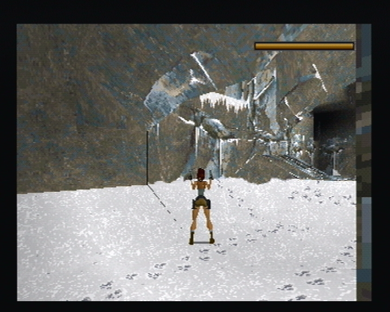
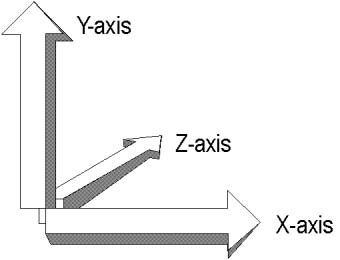
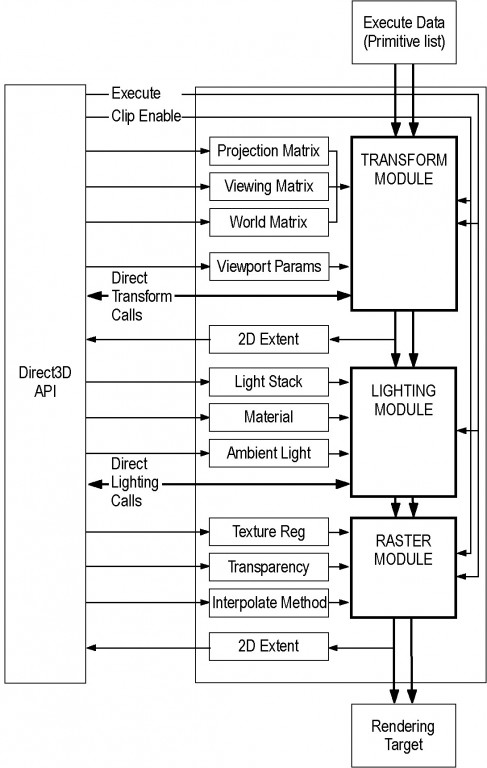
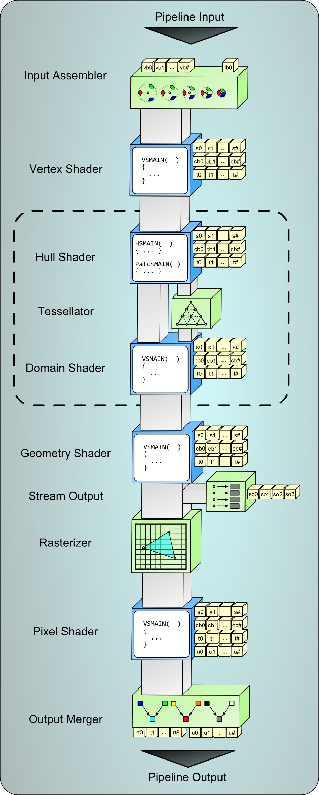
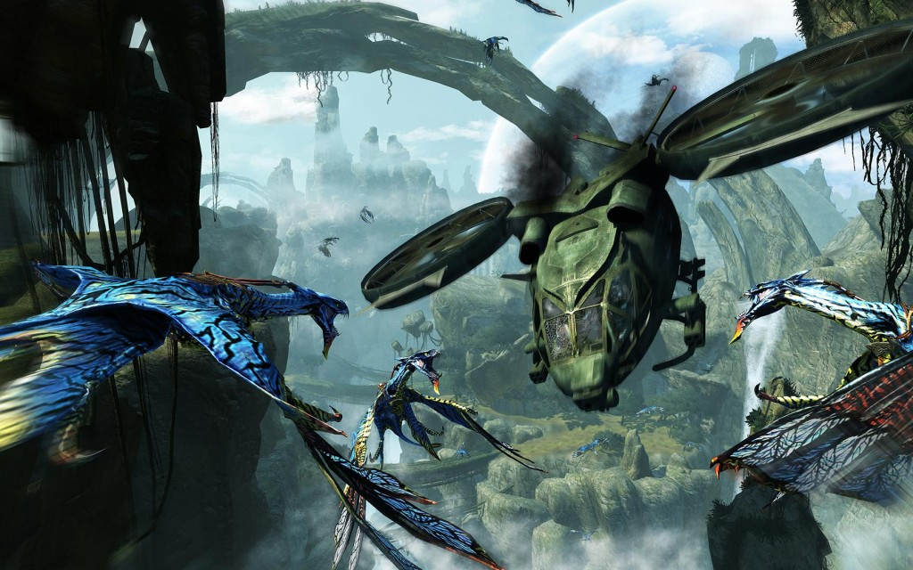

The Evolution of Direct3D
==========================

- **Saved from**: http://www.alexstjohn.com/WP/2013/07/22/the-evolution-of-direct3d/
- **Archive**: https://web.archive.org/web/20131125190248/http://www.alexstjohn.com/WP/2013/07/22/the-evolution-of-direct3d/

Posted on July 22, 2013 by TheSaint in DirectXFiles, GPU Programming, Graphics

**UPDATE:**  Be sure to read the comment thread at the end of this blog, the discussion got interesting.

It’s been many years since I worked on Direct3D and over the years the technology has evolved dramatically.  Modern GPU hardware has changed tremendously over the years achieving processing power and capabilities way beyond anything I dreamed of having access to in my lifetime.  The evolution of the modern GPU is the result of many fascinating market forces but the one I know best and find most interesting was the influence that Direct3D had on the new generation GPU’s that support thousands of processing cores, billions of transistors more than the host CPU and are many times faster at most applications.  I’ve told a lot of funny and political stories about how Direct3D was created but I would like to document some of the history of how the Direct3D architecture came about and the profound influence that architecture had on modern consumer GPU’s.

Published here with this article is the original DirectX 2 documentation for Direct3D when it was first introduced in 1995.  Contained in this document is an architecture vision for 3D hardware acceleration that was largely responsible for shaping the modern GPU into the incredibly powerful, increasingly general purpose ubiquitous consumer supercomputers we see today.

D3DOVER
-------

The reason I got into computer graphics was NOT an interest in gaming, it was an interest in computational simulation of physics.  I studied 3D at Siggraph conferences in the late 1980’s because I wanted to understand how to approach simulating quantum mechanics, chemistry and biological systems computationally.  Simulating light interactions with materials was all the rage at Siggraph back then so I learned 3D.  Understanding 3D mathematics and light physics made me a graphics and color expert which got me a career in the publishing industry early on creating PostScript RIP’s (Raster Image Processors).  I worked with a team of engineers in Cambridge England creating software solutions for printing screened color graphics before the invention of continuous tone printing.  That expertise got me recruited by Microsoft in the early 1990’s to re-design the Windows 95 and Windows NT print architecture to be more competitive with Apple’s superior capabilities at that time.  My career came full circle back to 3D when, an initiative I started with a few friends to re-design the Windows graphics and media architecture (DirectX) to support real-time gaming and video applications, resulted in gaming becoming hugely strategic to Microsoft.  Sony introduced 3D in a consumer game console (the Playstation 1) and being responsible for DirectX it was incumbent on us to find a 3D solution for Windows as well.

For me, the challenge in formulating a 3D strategy for consumer gaming for Microsoft was an economic one.  What approach to consumer 3D should Microsoft take to create a vibrant competitive market for consumer 3D hardware that was both affordable to consumers AND future proof?  The complexity of simulating 3D graphics realistically in real-time was so far beyond our capabilities in that era that there was NO hope of choosing a solution that was anything short of an ugly hack that would produce “good enough” 3D for games while being very far removed from the mathematically ideal solutions we had little hope of seeing implemented in the real-world during our careers.

Up until that point only commercial solutions for 3D hardware were for CAD (Computer Aided Design) applications.  These solutions worked fine for people who could afford hundred thousand dollar work stations.  Although the OpenGL API was the only “standard” for 3D API’s that the market had, it had not been designed with video game applications in mind.  For example, texture mapping, an essential technique for producing realistic graphics was not a priority for CAD models which needed to be functional, not look cool.  Rich dynamic lighting was also important to games but not as important to CAD applications.  High precision was far more important to CAD applications than gaming.  Most importantly OpenGL was not designed for real-time highly interactive graphics that used off-screen page buffering to avoid video tearing artifacts during rendering.   It was not that the OpenGL API could not be adapted to handle these features for gaming, simply that it’s actual market implementation on expensive workstations did not suggest any elegant path to a $200 consumer gaming card.

In the early 1990’s computer RAM was very expensive, as such, early consumer 3D hardware designs optimized for minimal RAM requirements.  The Sony Playstation 1 optimized for this problem by using a 3D hardware solution that did not rely on a memory intensive data structure called a Z-buffer, instead they used a polygon level sorting algorithm that produced ugly intersections between moving joints.  The “Painters algorithm” approach to 3D was very fast and required little RAM.  It was an ugly but pragmatic approach for gaming that would have been utterly unacceptable for CAD applications.

In formulating the architecture for Direct3D we were faced with enumerable similar difficult choices.  We wanted the leading Windows graphics vendors of the time; ATI, Cirrus, Trident, S3, Matrox and many others to be able to compete with one another for rapid innovation in 3D hardware without creating utter market chaos.  The technical solution that Microsoft’s OpenGL team espoused via Michael Abrash was a driver model called 3DDDI (3D Device Driver Interface).  3DDDI was a very simple flat driver model that just supported the hardware acceleration of 3D rasterization.  The complex mathematics associated with transforming and lighting a 3D scene were left to the CPU.  3DDDI used “capability bits” to specify additional hardware rendering features (like filtering) that consumer graphics card makers could optionally implement.  The problem with 3DDDI was that it invited problems for game developers out of the gate.  There were so many cap-bits that every game would either have to support an innumerable number of unspecified hardware feature combinations to take advantage of every possible way that hardware vendors might choose to design their chips producing an untestable number of possible consumer hardware configurations and a huge amount of redundant art assets that games would have to lug around to look good on any given device OR games would revert to using a simple set of common 3D features supported by everyone and there would be NO competitive advantage for hardware companies to support new 3D capabilities that did not have instant market penetration.   The OpenGL crowd at Microsoft didn’t see this as a big problem because in their world everyone just bought a $100,000 workstation that supported everything they needed.

The realization that we could not get what we needed from the OpenGL team was one of the primary reasons we decided to create a NEW 3D API just for gaming.  It had nothing to do with the API, but with the driver architecture underneath because we needed to create a competitive market that didn’t result in chaos.  In this respect the Direct3D API was not an alternative to the OpenGL API, ***it was a driver API designed for the sole economic purpose of creating a competitive market for consumer 3D hardware.***  In other words, the Direct3D API was not shaped by “technical” requirements so much as economic ones.  In this respect the Direct3D API was revolutionary in several interesting ways that had nothing to do with the API itself but rather the driver architecture it would rely on.

When we decided to acquire a 3D team to build Direct3D I was chartered with surveying the market for candidate companies with the right expertise to help us build the API we needed.  As I have previously recounted we looked at Epic Games (creators of the UnReal engine), Criterion (later acquired by EA), Argonaut and finally Rendermorphics.  We chose Rendermorphics (based in London) because of the large number of quality 3D engineers the company employed and because the founder, Servan Kiondijian, had a very clear vision of how consumer 3D drivers should be designed for maximum future compatibility and innovation.  The first implementation of Direct3D was rudimentary but the API quickly evolved towards something with much greater future potential.

*Whoops*

My principal memory from that period was a meeting in which I, as the resident 3D expert on the DirectX team, was asked to choose a handedness for the Direct3D API.  I chose a left handed coordinate system, in part out of personal preference.  I remember it now only because it was an arbitrary choice that caused no end of grief for years afterwards as all other graphics authoring tools adopted the right handed coordinate system standard to OpenGL.  At the time nobody knew or believed that a CAD tool like Autodesk would evolve to become the standard tool for authoring game graphics.  Microsoft had acquired SoftImage with the intention of displacing Autodesk and Maya anyway.  Whoops…

The early Direct3D HAL (Hardware Abstraction Layer) was designed in an interesting way.  It was structured vertically into three stages.

The highest most abstract layer was the transformation layer, the middle layer was dedicated to lighting calculations and the bottom layer was for rasterization of the finally transformed and lit polygons into depth sorted pixels.  The idea behind this vertical driver structure was to provide a relatively rigid feature path for hardware vendors to innovate along.  They could differentiate their products from one another by designing hardware that accelerated increasingly higher layers of the 3D pipeline resulting in greater performance and realism without incompatibilities or a sprawling matrix of configurations for games to test against or requiring redundant art assets.   Since the Direct3D API created by Rendermorphics provided a “pretty fast” software implementation for any functionality not accelerated by the hardware, game developers could focus on the Direct3D API without worrying about myriad permutations of incompatible 3D hardware capabilities.   At least that was the theory.  Unfortunately like the 3DDDI driver specification, Direct3D still included capability bits designed to enable hardware features that were not part of the vertical acceleration path.  Although I actively objected to the tendency of Direct3D to accumulate capability bits, the team felt extraordinary competitive pressure from Microsoft’s own OpenGL group and from the hardware vendors to support them.

The hardware companies, seeking a competitive advantage for their own products, would threaten to support and promote OpenGL to game developers because the OpenGL driver model supported capability bits that enabled them to create features for their hardware that nobody else supported.  It was common (and still is) for the hardware OEM’s to pay game developers to adopt features of their hardware unique to their products but incompatible with the installed base of gaming hardware, forcing consumers to constantly upgrade their graphics cards to play the latest PC games.  Game developers alternately hated capability bits because of their complexity and incompatibilities but wanted to take the marketing dollars from the hardware OEM’s to support “non-standard” 3D features.

Overall I viewed this dynamic as destructive to a healthy PC gaming economy and advocated resisting the trend regardless of what the OpenGL people or OEM’s wanted.   I believed that creating a stable consistent consumer market for PC games was more important than appeasing the hardware OEM’s.  As such as I was a  strong advocate of the relatively rigid vertical Direct3D pipeline and a proponent of only introducing API features that we expected to become universal over time.  I freely confess that this view implied significant constraints on innovation in other areas and a placed a high burden of market prescience on the Direct3D team.

The result, in my estimation, was pretty good.  The Direct3D fixed function pipeline, as it was known, produced a very rich and growing PC game market with many healthy competitors through to DirectX 7.0 and the early 2000’s.  The PC game market boomed and grew to be the largest game market on Earth.  It also resulted in a very interesting change in the GPU hardware architecture over time.

Had the Direct3D HAL been a flat driver model for rasterization with just capability bits as the OpenGL team at Microsoft had advocated, 3D hardware makers would have competed by accelerating just the bottom layer of the 3D rendering pipeline and adding differentiating features to their hardware via capability bits that were incompatible with their competitors.  The result of introducing the vertical layered HAL architecture was that 3D hardware vendors were all encouraged to add features to their GPU’s more consistent with general purpose CPU architectures, namely very fast floating point operations, in a consistent way.  Thus consumer GPU’s evolved over the years to increasingly resemble general purpose CPU’s… with one major difference.  Because the 3D fixed function pipeline was rigid, the Direct3D architecture afforded very little opportunity for frequent code branching as CPU’s are designed to optimize for.  GPU’s achieved their amazing performance and parallelism in part by being free to assume that little or no code branching would ever occur inside a Direct3D graphics pipeline.  Thus instead of evolving one giant monolithic CPU core that has massive numbers of transistors dedicated to efficient branch prediction as an Intel CPU has, a Direct3D GPU has hundreds to thousands of simple CPU like cores that have no branch prediction.  They can chew through a calculation at incredible speed confident in the knowledge that they will not be interrupted by code branching or random memory accesses to slow them down.

Up through DirectX 7.0 the underlying parallelism of the GPU was hidden from the game.  As far as the game was concerned some hardware was just faster than other hardware but the game shouldn’t have to worry about how or why.  The early DirectX fixed function pipeline architecture had done a brilliant job of enabling dozens of disparate competing hardware vendors to all take different approaches to achieving superior cost and performance in consumer 3D without making a total mess of the PC game market for the game developers and consumers.  It wasn’t entirely pretty and wasn’t executed with flawless precision but it worked well enough to create an extremely vibrant PC game market through to the early 2000’s.

Before I move on to discussing more modern Direct3D evolution, I would like to highlight a few other important ideas that early Direct3D architecture influenced in modern GPU’s.  Recalling that in the early to mid 1990’s RAM was relatively expensive there was a lot of emphasis on consumer 3D techniques that conserved on RAM usage.  The Talisman architecture which I have told many (well-deserved) derogatory stories about was highly influenced by this observation.

Search this blog for tags “Talisman” and “OpenGL” for many stories about the internal political battles within Microsoft over these technologies

Talisman relied on a grab bag of graphic “tricks” to minimize GPU RAM usage that were not very generalized.  The Direct3D team, heavily influenced by the Rendermorphics founders had made a difficult philosophical choice in approach to creating a mass market for consumer 3D graphics.  We had decided to go with a simpler more general purpose approach to 3D that relied on a very memory intensive data structure called a Z-buffer to achieve great looking results.  Rendermorphics had managed to achieve very good 3D performance in pure software with a software Z-buffer in the Rendermorphics engine which had given us the confidence to take the bet to go with a simpler more general purpose 3D API and driver model and trust that the hardware market and RAM prices would eventually catch up.  Note however that at the time that we were designing Direct3D we did not know about the Microsoft Research Groups “secret” Talisman project, nor did they expect that a small group of evangelists would cook up a new 3D API standard for gaming and launch it before their own wacky initiative could be deployed.   In short one of the big bets that Direct3D made was that the simplicity and elegance of Z-buffers to game development were worth the risk that consumer 3D hardware would struggle to affordably support them early on.

Despite the big bet on Z-buffer support we were intimately aware of two major limitations of the consumer PC architecture that needed to be addressed.  The first was that the PC bus was generally very slow and second it was much slower to copy data from a graphics card than it was to copy data to a graphics card.  What that generally meant was that our API design had to tend to send data in the largest most compact packages possible up to the GPU for processing and absolutely minimize any need to copy data back from the GPU for further processing on the CPU.  This generally meant that the Direct3D API was optimized to package data up and send it on a one-way trip.  This was of course an unfortunate constraint because there were many brilliant 3D effects that could be best accomplished by mixing the CPU’s efficient branch prediction and robust floating point support with the GPU’s incredible parallel rendering performance.

One of the fascinating consequences of that constraint was that it forced GPU’s to become even more general purpose to compensate for the inability to share data efficiently with the CPU.  This was possibly the opposite of what Intel intended to happen with its limited bus performance, because Intel was threatened by the idea that auxiliary processing cards would offload more work from their CPU’s thereby reducing the Intel CPU’s value and central role to PC computing.  It was reasonably believed at that time that Intel deliberately dragged their feet on improving PC bus performance to deter a market for alternatives to their CPU’s for consumer media processing applications.  Recall from my earlier Blogs that the main REASON for creating DirectX was to prevent Intel from trying to virtualize all Windows Media support on the CPU.  Had Intel adopted a PC Bus architecture that enabled extremely fast shared access to system RAM by auxiliary devices, it is less likely that GPU’s would have evolved the relatively rich set of branching and floating point operations they support today.

To overcome the fairly stringent performance limitations of the PC bus a great deal of thought was put into techniques for compressing and streamlining DirectX assets being sent to the GPU to minimize bus bandwidth performance limitations and the need for round trips from the GPU back to the CPU.  The early need for the rigid 3D pipeline had interesting consequences later on when we began to explore streaming 3D assets over the Internet via modems.

We recognized early on that support for compressed texture maps would dramatically improve bus performance and reduce the amount of onboard RAM consumer GPU’s needed, the problem was that no standards existed for 3D texture formats at the time and knowing how fast image compression technologies were evolving at the time I was loathe to impose a Microsoft specified one “prematurely” on the industry.   To overcome this problem we came up with the idea of “blind compression formats”.  The idea, which I believe was captured in one of the many DirectX patents that we filed, had the idea that a GPU could encode and decode image textures in an unspecified format but that the DirectX API’s would allow the application to read and write from them as though they were always raw bitmaps.  The Direct3D driver would encode and decode the image data as necessary under the hood without the application needing to know about how it was actually being encoded on the hardware.

By 1998 3D chip makers had begun to devise good quality 3D texture formats such that by DirectX 6.0 we were able to license one of them (from S3) for inclusion with Direct3D.

http://www.microsoft.com/en-us/news/press/1998/mar98/s3pr.aspx

DirectX 6.0 was actually the first version of DirectX that was included in a consumer OS release (Windows 98).  Until that time, DirectX was actually just a family of libraries that were shipped by the Windows games that used them.  DirectX was not actually a Windows API until five generations after its first release.

DirectX 7.0 was the last generation of DirectX that relied on the fixed function pipeline we had laid out in DirectX 2.0 with the first introduction of the Direct3D API.  This was a very interesting transition period for Direct3D for several reasons;

1. The original DirectX team founders had all moved on,
2. Talisman and Microsoft’s internal reasons for supporting OpenGL had all passed
3. Microsoft had brought game industry veterans like Seamus Blackley, Kevin Bacchus, Stuart Moulder and others into the company in senior roles.
4. Gaming had become a strategic focus for the company

DirectX 8.0 marked a fascinating transition for Direct3D because with the death of Talisman and the loss of strategic interest in OpenGL support many of the 3D people from these groups came to work on Direct3D.  Talisman, OpenGL and game industry veterans all came together to work on Direct3D 8.0.   The result was very interesting.  Looking back I freely concede that I would not have made the same set of choices that this group made for DirectX 8.0 but in retrospect it seems to me that everything worked out for the best anyway.

Direct3D 8.0 was influenced in several interesting ways by the market forces of the late 20th century.  Microsoft largely unified against OpenGL and found itself competing with the Kronos Group standards committee to advance Direct3D faster than OpenGL.  With the death of SGI, control of the OpenGL standard fell into the hands of the 3D hardware OEM’s who of course wanted to use the standard to enable them to create differentiating hardware features from their competitors and to force Microsoft to support 3D features they wanted to promote. The result was the Direct3D and OpenGL became much more complex and they tended to converge during this period.  There was a stagnation in 3D feature adoption by game developers from DirectX 8.0 through to DirectX 11.0 as a result of these changes.  Creating game engines became so complex that the market also converged around a few leading engine providers including Epic’s Unreal Engine and the Quake engine from id software.

Had I been working on Direct3D at the time I would have stridently resisted letting the 3D chip OEM’s lead Microsoft around by the nose chasing OpenGL features instead of focusing on enabling game developers and a consistent quality consumer experience.   I would have opposed introducing shader support in favor of trying to keep the Direct3D driver layer as vertically integrated as possible to ensure feature conformity among hardware vendors.  I also would have strongly opposed abandoning DirectDraw support as was done in Direct3D 8.0.  The 3D guys got out of control and decided that nobody should need pure 2D API’s once developers adopted 3D, failing to recognize that simple 2D API’s enabled a tremendous range of features and ease of programming that the majority of developers who were not 3D geniuses could easily understand and use.  Forcing the market to learn 3D dramatically constrained the set of people with the expertise to adopt it.  Microsoft later discovered the error in this decision and re-introduced DirectDraw as the Direct2D API.  Basically letting the 3D geniuses design Direct3D 8.0 made it brilliant, powerful and useless to average developers.

At the time that DirectX 8.0 was being made I was starting my first company WildTangent Inc. and ceased to be closely involved with what was going on with DirectX features, however years later I was able to get back to my 3D roots and took the time to learn Direct3D programming in DirectX 11.1.  Looking back it’s interesting to see how the major architectural changes that were made in DirectX 8 resulted in the massively convoluted and nearly incomprehensible Direct3D API we see today.  Remember the 3 stage DirectX 2 pipeline that separated Transformation, lighting and rendering into three basic pipeline stages?  Here is a diagram of the modern DirectX 11.1 3D pipeline.

Yes, it grew to 9 stages and arguably 13 stages when some of the optional sub stages, like the compute shader, are included.  Speaking as somebody with an extremely lengthy background in very low level programming and 3D graphics I’m embarrassed to confess that I struggled mightily to learn Direct3D 11.1 programming.  The API had become very nearly incomprehensible and unlearnable.   I have no idea how somebody without my extensive background in 3D and graphics could ever begin to learn how to program a modern 3D pipeline.  As amazingly featureful and powerful as this pipeline is, it is also damn near unusable by any but a handful of the brightest most antiquated minds in 3D graphics.  In the course of catching up on my Direct3D I found myself simultaneously in awe of the astounding power of modern GPU’s and where they were going and in shocked disgust at the absolute mess the 3D pipeline had become.  It was as though the Direct3D API had become a dumping ground for 3D features that every OEM had demanded over the years.

Had I not enjoyed the benefit of decade long break from Direct3D involvement I would undoubtedly have a long history of bitter blogs written about what a mess my predecessors had made of a great and elegant vision for consumer 3D graphics.  Weirdly, however, leaping forward in time to the present day, I am forced to admit that I’m not sure it was such a bad thing after all.  The result of gaming stagnation on the PC as a result of the mess Microsoft and the OEMS made of the Direct3D API was a successful XBOX.  Having a massively fragmented 3D API isn’t such a problem if there is only one hardware configuration game developers have to support, as is the case with a game console.  Direct3D 8.0 with early primitive shader support was the basis for the first XBOX’s graphics API.  For the first XBOX Microsoft selected an NVDIA chip giving NVIDIA a huge advantage in the PC 3D chip market.   DirectX 9.0, with more advanced shader support, was the basis for the XBOX 360, for which Microsoft selected ATI to provide the 3D chip, this time handing AMD a huge advantage in the PC graphics market.  In a sense the OEM’s had screwed themselves.  By successfully influencing Microsoft and the OpenGL standards groups to adopt highly convoluted graphics pipelines to support all of their feature sets, they had forced themselves to generalize their GPU architectures and consolidated the 3D chip market around whatever 3D chip architecture… Microsoft selected for its consoles.

The net result was that the retail PC game market largely died.  It was simply too costly, too insecure and too unstable a platform for publishing high production value games on any longer, with the partial exception of MMOG’s.  Microsoft and the OEM’s had conspired together to kill the proverbial golden goose.  No biggie for Microsoft as they were happy to gain complete control of the former PC game business by virtue of controlling the XBOX.

From the standpoint of the early DirectX vision, I would have said that this outcome was a foolish, shortsighted disaster.  Had Microsoft maintained a little discipline and strategic focus on the Direct3D API they could have ensured that there were NO other consoles in existence in a single XBOX generation by using the XBOX to strengthen the PC game market rather than inadvertently destroying it.  While Microsoft congratulates itself for launching the first successful US console, I would count all the gaming dollars collected by Sony, Nintendo and mobile gaming platforms over the years that might have remained on Microsoft controlled platforms had Microsoft maintained a cohesive media strategy across platforms.  I say all of this from a past tense perspective because, today, I’m not so sure that I’m really all that unhappy with the result.

The new generation of consoles from Sony AND Microsoft have reverted to a PC architecture!  The next generation GPU’s are massively parallel, general purpose processors with intimate access to the shared memory with the CPU.  In fact, GPU architecture became so generalized that a new pipeline stage was added in DirectX 11 called DirectCompute that simply allowed the CPU to bypass the entire convoluted Direct3D graphics pipeline in favor of programming the GPU directly.  With the introduction of DirectCompute the promise of simple 3D programming returned in an unexpected form.  Modern GPU’s have become so powerful and flexible that the possibility of writing cross GPU 3D engines directly for the GPU without making any use of the traditional 3D pipeline is an increasingly practical and appealing programming option.  From my perspective here in the present day, I would anticipate that within a few short generations the need for the traditional Direct3D and OpenGL API will vanish in favor of new game engines with much richer and more diverse feature sets that are written entirely in device independent shader languages like Nvidia’s CUDA and Microsoft’s AMP API’s.

Today, as a 3D engine and physics developer I have never been so excited about GPU programming because of the sheer power and relative ease of programming directly to the modern GPU without needing to master the enormously convoluted 3D pipelines associated with Direct3D and OpenGL API’s.  If I were responsible for Direct3D strategy today I would be advocating dumping investment in the traditional 3D pipeline in favor of rapidly opening access to a rich direct GPU programming environment.  I personally never imagined that my early work on Direct3D, would, within a couple decades, contribute to the evolution of a new kind of ubiquitous processor that enabled the kind of incredibly realistic and general modeling of light and physics that I had learned in the 1980′s but never believed I would see computers powerful enough to model in real-time during my active career.

Ditching the traditional 3D pipeline in favor of pure GPU based game engines may produce real-time ray traced worlds and game mechanics beyond anything we imagined in a few short generations.

 

Direct3D API Fossils
---------------------

- Left handed coordinate system, my bad introduced in DirectX 2.0
- Microsoft COM API, baggage from the Windows 95 days
- Anisotropic filtering, the last vestige of Talisman to be found in Direct3D.
- Shaders, introduced in DirectX 8.0 marked the end of the fixed function graphic pipeline and the advent of the modern, enormously complex, many stage shader pipeline.

UPDATE:
--------

Wow, this blog entry seems to have struck a chord, it had more hits in a couple hours than every blog entry I’ve ever written combined.  It makes me want to go back through the article and check my punctuation again.  I’ve written so many blogs on this subject that I usually don’t try to credit all of the brilliant people who worked on Direct3D over the years in every entry but in this case it seems that some additional credits are appropriate.  Although I had a very hands on role early in crafting Direct3D and in the overall strategy, there were many exceptional people who really made this technology happen.

- Eric Engstrom was the first DirectX Program Manager and it was his frustration with Microsoft’s OpenGL team that lead him to conclude that if they wouldn’t work with us, HE was going to make his own 3D API.  Eric is a mad visionary who works for Microsoft to this day and he made Direct3D happen.
- Craig Eisler was the first DirectX developer.  Craig single handedly created several of the early DirectX API’s and his amazing leadership, technical acumen and work ethic made the DirectX team one of the most prolific and groups at Microsoft over many generations of the early DirectX technology.  Craig also still works for Microsoft and is responsible for the XBOX ONE online service having just turned over responsibility for the Kinect project to another early DirectX veteran Bob Heddle.
- Kate Seekings, Servan Keondijian, Collin McCartney and all of the early Rendermorphics engineers who created the Reality Lab game engine that Direct3D was based on.  Kate went on to become the 3D evangelist for Direct3D working for me at Microsoft where she was tireless at promoting 3D adoption within Microsoft and the game industry.
- Phil Taylor, who was the first Direct3D technical evangelist working with the game developer community to get their input and feedback into the DirectX team to ensure that the API’s and SDK documentation and sample code were all usable and who worked closely with the very early Direct3D adopters to be successful with it
- There were many many other amazing people who contributed to Direct3D over the years… even the ones who came from the Talisman and the OpenGL groups eventually made themselves useful and deserve recognition…  :)   Mike Abrash, Otto Berkes, Mark Kenworthy, Chas Boyd to name a few that come to mind years later.
- Jason Robar and all of the other great evangelists who later joined the DirectX team of course did a fantastic job of supporting the thousands of developers who adopted the API.
- Of course the contributions and input (criticism) from so many game industry veterans like Seamus Blackley, Zack Simpson and John Carmack were also invaluable during the formative DirectX years.
